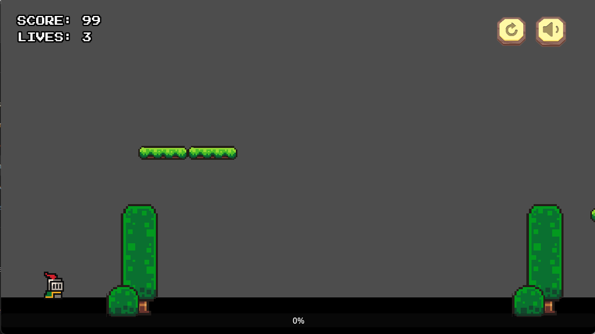
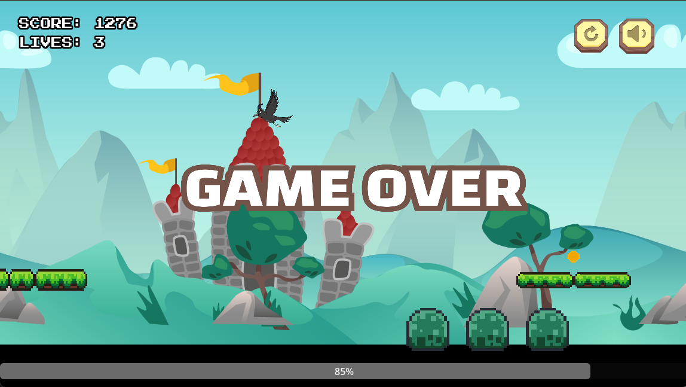

# Tintoria

## Description
Tintoria is an infinite platformer running game where the player takes the role of an artist striving to complete the “ultimate painting.”  

Set in a once-vibrant but now colorless world, the player travels through shifting terrains, collecting color patches to paint the ultimate masterpiece. Each color patch contributes to restoring a specific scenery (or painting), but the artist’s urge for perfection drives them to abandon works-in-progress and continue searching for the ultimate creation.  

This reminds the player of the core concept: **“Take one, leave the rest.”** It puts the player in an artist's perspective, leaving them the choice between creation and perfectionism—either to enrich the current artwork or to continue searching for the ultimate creation, learning the value of prioritizing some pieces while letting others go.

---

## Screenshots
<!-- Add your game images below -->

---

